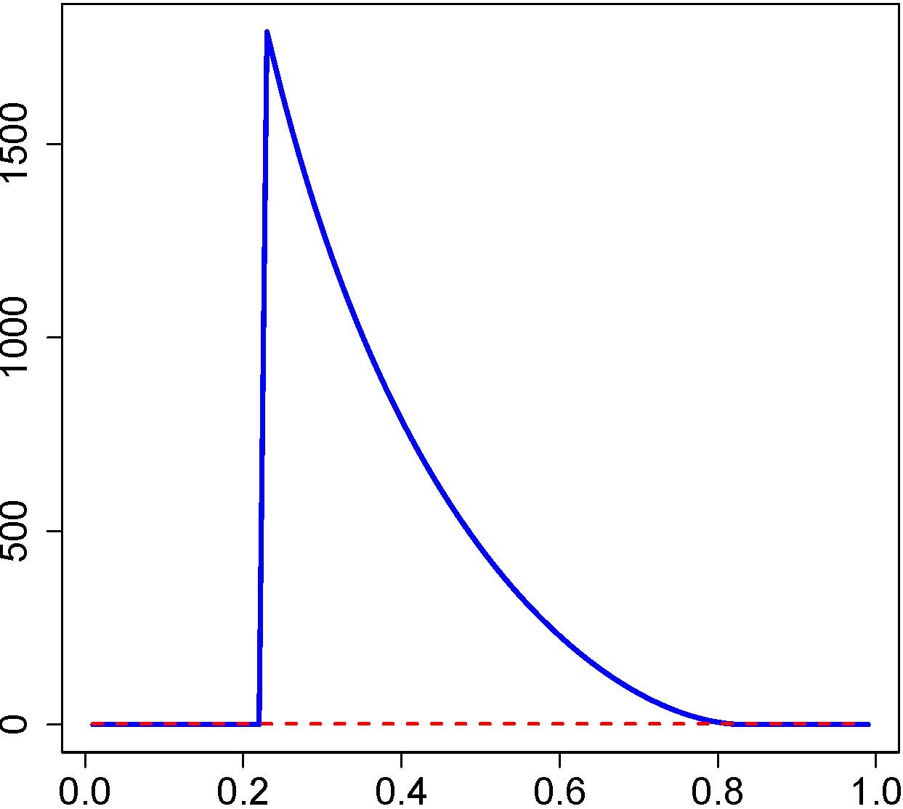

[](http://quantlet.de/)

## [](http://quantlet.de/) **GrangerCausalityTestInQuantile_Simulation** [](http://quantlet.de/)

```yaml

Name of Quantlet : GrangerCausalityTestInQuantile_Simulation

Published in : Econometric Theory, 28, 2012, 861-887

Description : Simulations are carried out to illustrate the behavior of the test under the null and also the power of the test under plausible alternatives. An economic application considers the causal relations between the crude oil price, the USD/GBP exchange rate, and the gold price in the gold market.

Keywords : Simulation, nonparametric test, Gaussian causality in quantile

Author : Song Song

Datafile : gold.txt, oil.txt, OilGold.txt, rate.txt, RateGold.txt, Data.xls, rate.xls
```




### R Code
```r

#rm(list=ls(all=TRUE))
library(quantreg)
library(KernSmooth)
#setwd("C:/Richard/Study/Quantile Regression/Jeo Hae Son Quantile Causality Test/Program")

"lprq2" <- function(x, y, h, tau, x0) # modified from lprq, s.t. we can specify where to estimate quantiles
{       xx <- x0
        fv <- xx
        dv <- xx
        for(i in 1:length(xx)) {
                z <- x - xx[i]
                wx <- dnorm(z/h)
                r <- rq(y~z, weights=wx, tau=tau, ci=FALSE)
                fv[i] <- r$coef[1.]
                dv[i] <- r$coef[2.]
        }
        list(xx = xx, fv = fv, dv = dv)}
        
# generate AR1 process, similar for ARMA, n  is the #, mu is the constant, phi is the AR1 coefficient, sigma2 is the variance, burn is just internal used, some "staring" point
generateAR1<-function(n,mu,phi, sigma2, burn)
{arptemp<-rep(0,n+burn)
 error<-rnorm(n+burn, mean=0, sd=sqrt(sigma2))
 for ( i in 2:(n+burn)) {
        arptemp[i]<-mu+phi*arptemp[i-1]+error[i]
        }
        return(arptemp[1:(burn+n)])     # this indeed returns 1:5500 overall 5501 items
}
# generate y process, alpha means the significance of the causality and caus is the causality-bringing variable
generatey<-function(n,mu,phi, sigma2, burn, alpha, caus){
arptemp<-rep(0,n+burn)
error<-rnorm(n+burn, mean=0, sd=sqrt(sigma2))
for ( i in 2:(n+burn)) {
        arptemp[i]<-mu+phi*arptemp[i-1]+ alpha*caus[i-1]+error[i]
        }
        return(arptemp[(burn):(burn+n)])   # this indeed returns 5000:5500 overall 501 items
}

############# Parameter Set
qvec <-seq(0.01, 0.99, by = 0.01)
tstatvec <- vector(length= 99, mode="numeric") # initilize the tstat vector

############ Simulate Data, could be replaced by real data
#test <- function(tn, alpha){       # alpha = how strong the causality is      tn  # T
alpha = 0.05 # how strong the causality is  
tn = 5000  # T
repeatation =500 # to repeat the test to get the ppower
powertemp = 0 
q = qvec[90] # quantile
ppower=0
for (repn in 1:repeatation) {
w<-generateAR1(tn, 1, 1/2, 1, 5000)
y<-generatey(tn, -qnorm(q), 1/2, 1, 5000, alpha, w^2)
w = w[5000:(5000+tn-1)]

#gold<-read.table("gold.txt") #
#oil<-read.table("oil.txt") #
#gbp<-read.table("gbp.txt") #
#w <- data.matrix(gold) # here is the log returns
#y <- data.matrix(gbp) # here is the log returns
#tn = length(y)-1
#plot(data.matrix(gold)/5,lty = 1, type = "l", lwd=4, col = "red", xlab="Days (19970220 - 20090717)", ylab="Oil - Gold - GBP/USD", cex.lab=2, cex.axis = 2, ylim = c(min(min(data.matrix(oil)), min(data.matrix(gold)/5), min(data.matrix(gbp))*100), max(max(data.matrix(oil)), max(data.matrix(gold)/5), max(data.matrix(gbp))*100)))
#lines(data.matrix(oil), col = "blue", lty = 2, lwd=3)
#lines(data.matrix(gbp)*100, col = "darkgreen", lty = 3, lwd=3)
############ Main computation part

yuv <-y[1: tn]
yur <-y[2:(tn+1)]
h <- dpill(yuv, yur, gridsize = tn) # calculate the optimal bandwith qrh which is based on the optimal bandwidth from mean regression, as in yu and jones 1998

#for  ( jj in 1:99) {
qrh <- h*((q*(1-q)/(dnorm(qnorm(p=q))^2))^(1/5))
fit <- lprq2(yuv,yur,h= qrh,tau=q, x0=yuv)
iftemp <- (yur <=fit$fv) - q
ifvector <- data.matrix(iftemp)
kk <- matrix(data = 0, nrow = tn, ncol = tn)
ymatrix = kronecker(y[1: tn], t(vector(length= tn, mode="numeric")+1))-t(kronecker(y[1: tn], t(vector(length= tn, mode="numeric")+1)))
wmatrix = kronecker(w[1: tn], t(vector(length= tn, mode="numeric")+1))-t(kronecker(w[1: tn], t(vector(length= tn, mode="numeric")+1)))
kk=dnorm(ymatrix/qrh)*dnorm(wmatrix/(qrh/sd(y)*sd(w)))
tstat <-  t(ifvector)%*%kk%*%ifvector*sqrt(tn/2/q/(1-q)/(tn-1)/sum(kk^2))
#tstatvec=tstat
powertemp = (tstat>1.96) + powertemp
ppower = powertemp/repn
print(repn)
print(ppower)
save.image(file = "90005.RData")
}
#return(ppower)
#}

#test(500, 0.0)    
#test(500, 0.03)
#test(500, 0.06)  
#test(500, 0.09)   
#test(500, 0.12)
#test(500, 0.15)
#test(500, 0.18)
#test(500, 0.21)
#test(500, 0.24)
#test(500, 0.27)
#test(500, 0.30)

#test(1000, 0.0)   
#test(1000, 0.01)
#test(1000, 0.02)    
#test(1000, 0.03)   
#test(1000, 0.04)
#test(1000, 0.05)
#test(1000, 0.06)
#test(1000, 0.07)
#test(1000, 0.08)
#test(1000, 0.09)
#test(1000, 0.10)
#test(1000, 0.11)
#test(1000, 0.12)
#test(1000, 0.13)
#test(1000, 0.14)
#test(1000, 0.15)

#plot(seq(0.01, 0.99, by = 0.01), tstatvec, lty = 1, type = "l", lwd=3, col = "blue", xlab="Different Quantiles", ylab="Test Statistic (Gold - GBP/USD)", cex.lab=1.6, cex.axis = 1.6, ylim=c(0, max(max(tstatvec), 1.96)))
#lines(seq(0.01, 0.99, by = 0.01), vector(length= 99, mode="numeric")+ 1.96, col = "red", lty = 2, lwd=2)
```

automatically created on 2018-10-15